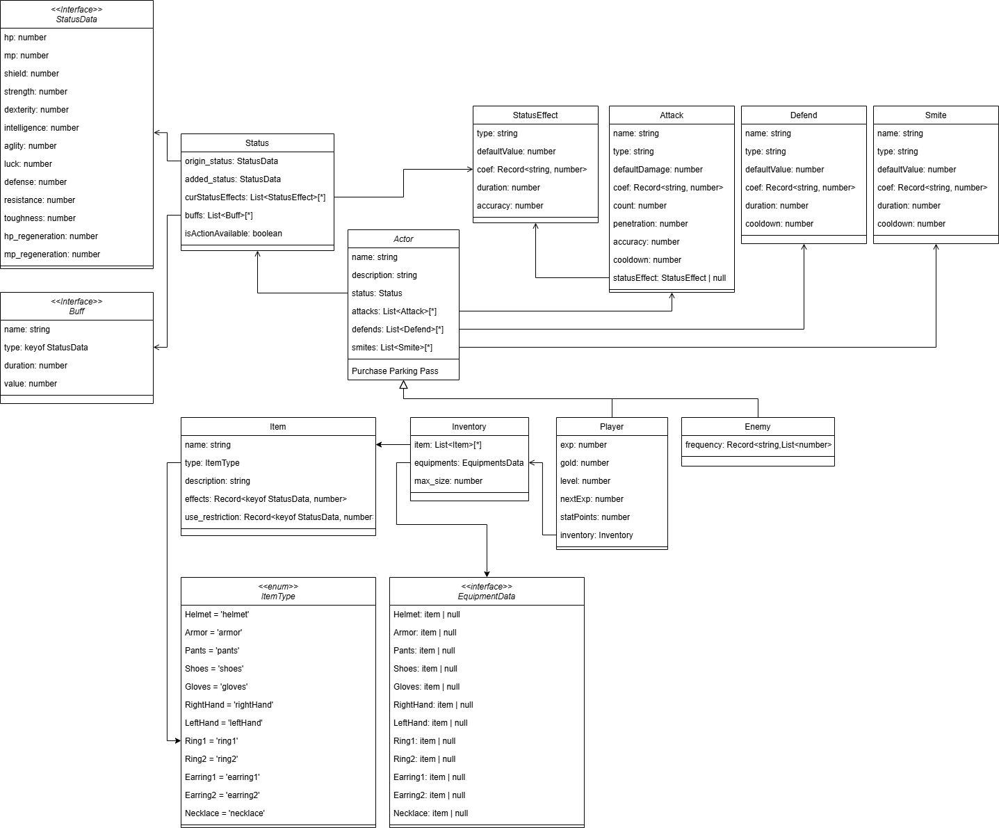
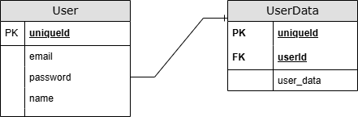

# AI-RPG
생성형 AI를 활용한 텍스트 기반 RPG 게임.

## 사용 모델

## Game Rule

### 스토리 선택
- 선택지에는 적정 스탯이 존재하고 선택지는 실패 확률과 성공 확률을 가진다.
- 적정 스탯보다 낮으면 실패 확률이 올라가고 높으면 성공 확률이 올라간다.
- 선택지를 누르면 1-20 까지의 랜덤한 숫자 하나를 뽑고 이 숫자가 특정 값보다 높으면 성공한다.
- 특정 값은 적정 스탯과 플레이어의 현재 스탯이 얼마나 차이가 나는 지에 따라 결정된다.


### 전투
- 전투 시 공격, 방어, 강타 3가지 행동을 할 수 있다.
- 공격 < 방어 < 강타 < 공격 의 가위 바위 보 식 상성 관계를 가진다.
- 각 행동에는 최대 4개의 스킬을 가질 수 있다.
- 적을 쓰러뜨리면 적이 사용하는 스킬 중 1개를 랜덤으로 획득 가능하다.


### 아이템
- 스토리 진행을 하다보면 아이템을 획득할 수 있다.
- 아이템은 스탯 제한이 존재하며 버프나 아이템으로 증가된 스탯이 제외된 수치가 기준이다.


## 시스템 아키텍쳐


## 클래스


## EDR



## 온라인 접속
```
https://tool7831.github.io/AI-RPG/
```
접속 관련은 tool7831@g.skku.edu 로 문의

## 오프라인 접속
```
git clone https://github.com/tool7831/AI-RPG.git
```
nodejs, python, openai api key가 필요합니다.

### 리액트 실행
node v20.17.0\
npm 10.8.2
```
cd react-app
npm install
npm start
```
리액트 환경변수

```
REACT_APP_FAST_API_URL=http://localhost:8000 #fastapi 주소
```

### FastAPI 실행
```
cd fastapi-app
pip install -r requirements
uvicorn main:app --reload
```
시스템 환경변수
```
OPENAI_API_KEY = api_key # 본인의 API key
```